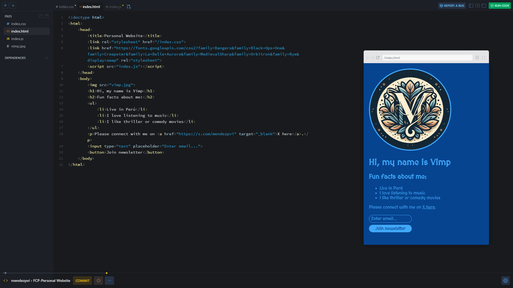
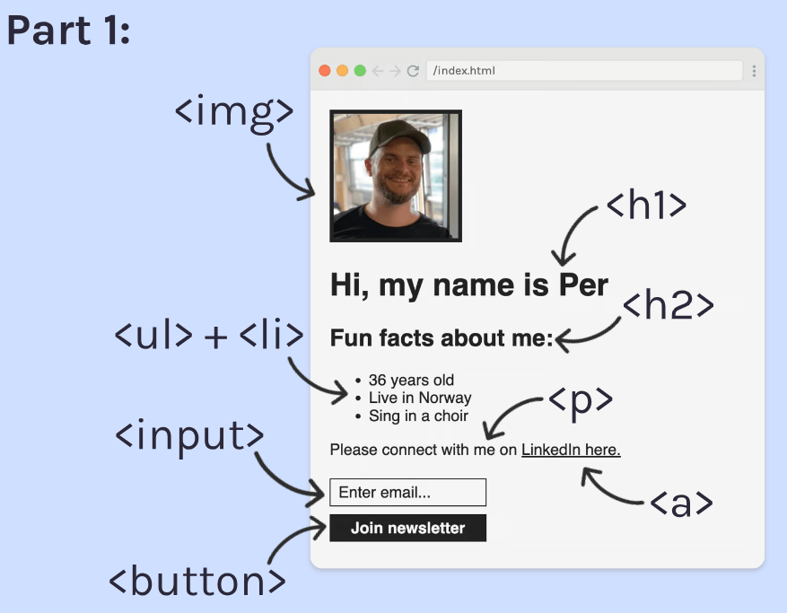

# Personal Website

## Overview 📝

As part of the **Web Dev Basics** module, we created a ***Personal Website***. The project was based on a wireframe provided by the instructor, which served as the foundation for the site's design and structure.

## Final result 📷

## *Wireframe* 🖼️

## Live Demo 🔗

[Scrim](https://v2.scrimba.com/s0m2taj2s6) 👀

[Live](https://mendezpvi.github.io/fcp-personal-website/) 👀

## Key Learnings 🤓

🔲 Core HTML tags.

🔲 Nesting.

🔲 Buttons.

🔲 Input field.

🔲 Anchor tags.

🔲 Document structure.

🔲 Lists.

🔲 Deployment.

## Author 🔰

✨ Frontend Mentor - [@medezpvi](https://www.frontendmentor.io/profile/mendezpvi)

✨ X (formerly Twitter) - [@medezpvi](https://x.com/mendezpvi)